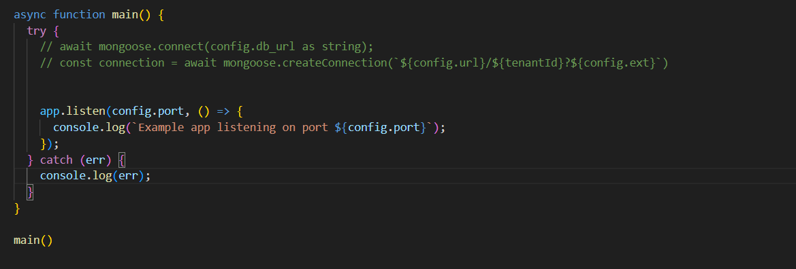
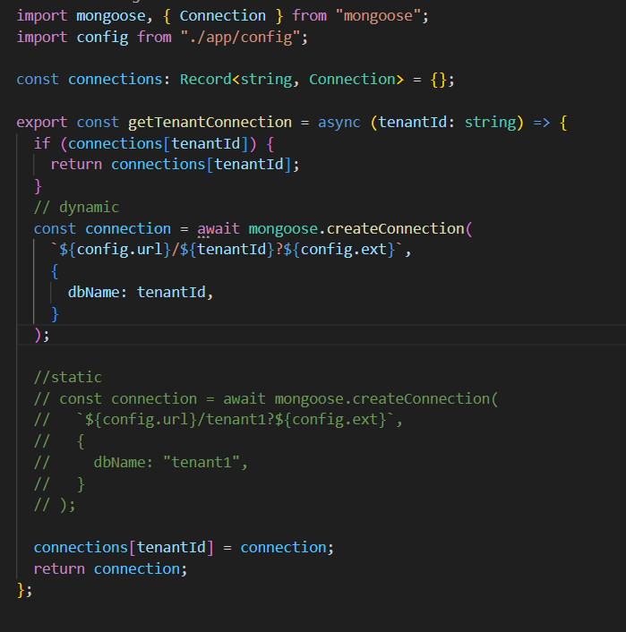
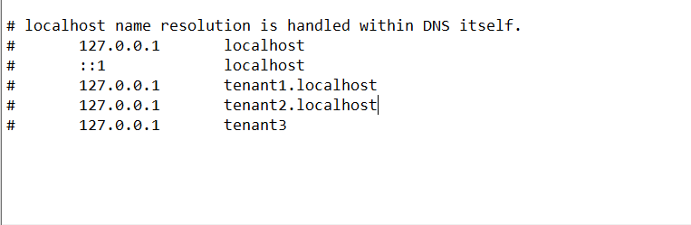

## set up the backend as usual

previously we used to connect with the database in out server.ts

this time we won't connect anything like before ; we will create a tenantDB.ts to create and connect the database



## create database and connect



```
const connections: Record<string, Connection> = {};

```

here , **connections** a dictionary object (cache) to store tenant-specific database connections.

**Record** is a utility type in ts that allows you to define an object type with specific keys and values

keys will be string type

**Connection** is object from mongoose that will hold the values for those keys ,those values will be specific database connection for the different tenant ids.

## To check multi-tenancy locally:

**Need to change the Host file**

Steps to do it:

1. Go to the search option and search for the notepad
2. right click on notepad and run as administrator
3. go to file --> open--> this pc --> drive c--> Windows --> System32 --> drivers --> etc
4. click on Text document and select All Files (_._)
5. click on the host file and click open
6. after editing any new lines click on file and save



--> When i tried 'http://tenant3:5000/api/v1/to-do-list' : this one did not work. as there was nothing to split with (.) and so there was nothing in array[0]
